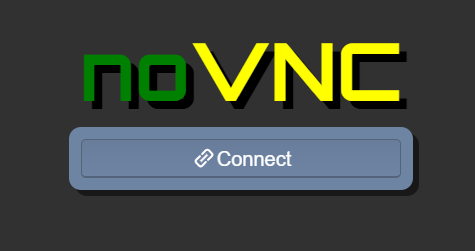
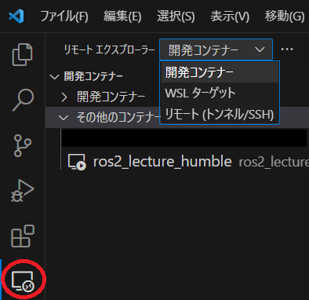

# ros2_lecture_humble-202309

## 必要なソフトのインストール

下記のソフトをインストールしてください。

1. [`Docker Desktop for Windows`](https://www.docker.com/products/docker-desktop/)
  - インターネット上に[日本語でのインストール方法](https://docs.docker.jp/docker-for-windows/install.html)についても解説があります。
  - `WSL2(Windows Subsystem for Linux 2)`を併用する方法でインストールしてください。
2. `Visual Studio Code`
  - 以降、VSCodeと表記します。
3. `WEB`ブラウザ
  - 種類は任意ですが、本ページでは`Chrome`を前提にご説明します。

## Docker イメージのインストール

Wifi通信の良好な環境にて実施してください。

[ros2_lecture_humble-202309.zip](https://github.com/KMiyawaki/ros2_lecture_humble/archive/refs/tags/202309.zip)をダウンロードし展開してください。ここでは`%USERPROFILE%\Documents\ros2_lecture_humble-202309`に展開したとします。

なお、`%USERPROFILE%`は`Windows`の環境変数で`C:\Users\[ログインユーザ名]`に置き換えられます。  
`Windows`のファイルエクスプローラーでアドレス欄に`%USERPROFILE%\Documents`と入力してエンターキーを押し、どのフォルダが開くかを確認してみてください。
`C:\Users\[ログインユーザ名]\Documents`が開くはずです。


展開後のフォルダには以下のファイルが含まれています。

```text
    docker-compose.yml
    README.md
    images # 説明文書の画像
```

まず[Docker Desktop for Windows](https://docs.docker.com/desktop/install/windows-install/)が**起動していることを必ず確認してください**。

以下の画面のようにWindowsのタスクトレイに`Docker Desktop for Windows`のアイコンが表示されていることを確認し、次の手順に移ってください。  
アイコンの表示が無ければ、`Windows`の[アプリ検索](https://support.microsoft.com/ja-jp/windows/%E3%81%99%E3%81%B9%E3%81%A6%E3%81%AE%E3%82%A2%E3%83%97%E3%83%AA%E3%81%A8%E3%83%97%E3%83%AD%E3%82%B0%E3%83%A9%E3%83%A0%E3%82%92%E6%A4%9C%E7%B4%A2%E3%81%99%E3%82%8B-cadb9c4b-459d-dfcb-2964-14aac1d7d964)で`Docker Desktop for Windows`を検索して実行してください。


`Docker Desktop for Windows`の起動を確認できたら`Windows`のコマンドプロンプトを起動し、次のコマンドを入力してください。  
なお、ファイルパスの`\`バックスラッシュは（円マーク）を意味しています。

```cmd
cd %USERPROFILE%\Documents\ros2_lecture_humble-202309
docker-compose pull
```

以下の画面のように環境のダウンロードが始まります。


終了したら次のコマンドを入力してください。

```cmd
docker images
```

次のように`REPOSITORY`に`ros2_humble_lxde`、`TAG`に`202309`のイメージがダウンロードされていれば成功です。  
`9612864073fc   24 minutes ago   3.77GB`の部分は多少異なる可能性があります。

```cmd
REPOSITORY                     TAG               IMAGE ID       CREATED        SIZE
kmiyawaki20/ros2_humble_lxde   202309            9612864073fc   24 minutes ago   3.77GB
```

## 起動

以下の画面のようにWindowsのタスクトレイに`Docker Desktop for Windows`のアイコンが表示されていることを確認し、次の手順に移ってください。

`Docker Desktop for Windows`が起動されていなければ、起動してから次の手順に移ってください。


`Docker Desktop for Windows`の起動を確認できたら、次のコマンドを入力してください。

```cmd
cd %USERPROFILE%\Documents\ros2_lecture_humble-202309
docker-compose up
```

次のようなメッセージが出力されます。

このコマンドを起動したターミナルは作業終了までは閉じないでください。

```cmd
[+] Building 0.0s (0/0)
・・・
Attaching to ros2_lecture_humble
ros2_lecture_humble  |
ros2_lecture_humble  | New Xtigervnc server 'dbfd199a41a8:1 (ubuntu)' on port 5901 for display :1.
ros2_lecture_humble  | Use xtigervncviewer -SecurityTypes None,TLSNone dbfd199a41a8:1 to connect to the VNC server.    
ros2_lecture_humble  |
ros2_lecture_humble  | WebSocket server settings:
ros2_lecture_humble  |   - Listen on :80
ros2_lecture_humble  |   - Web server. Web root: /usr/share/novnc
ros2_lecture_humble  |   - No SSL/TLS support (no cert file)
ros2_lecture_humble  |   - Backgrounding (daemon)
ros2_lecture_humble  | **********************************************
ros2_lecture_humble  | * Open 'http://127.0.0.1:6080/vnc.html'      *
ros2_lecture_humble  | * Or access '127.0.0.0:5901' via VNC viewer. *
ros2_lecture_humble  | **********************************************
```

任意のWEBブラウザで[http://127.0.0.1:6080/vnc.html](http://127.0.0.1:6080/vnc.html)に接続してください。  
次のような画面が出ますので、`Connect`を押してください。パスワードは不要です。



次のように`Linux`の`GUI`が表示されれば成功です。


もしも、`Linux`のデスクトップ画面が大きすぎてブラウザに入りきらない場合は`docker-compose.yml`をメモ帳で次のように変更してください。

```yaml
・・・
    environment:
      - USER=ubuntu
      - RESOLUTION=1024x600 # RESOLUTION=1280x800の数値を小さくする
      - TZ=Asia/Tokyo
    tty: true
・・・
```

編集後、以下の[終了](#終了)で一旦終了してから再度[起動](#起動)をしてみてください。

## 終了

WEBブラウザを閉じ、起動コマンドを実行したコマンドプロンプトで`Ctrl`キーと`C`キーを同時に押してください。

もし、終了しなければ２，３回`Ctrl`キーと`C`キーを同時に押してください。それでも終了しない場合は起動コマンドを実行したコマンドプロンプトを閉じてください。

## ROS2の動作確認

練習のために、できれば一度PCを再起動し、上記の「[起動](#起動)」をもう一度実施してみてから次の手順に移ってください。

### コマンドターミナルの起動とTurtlesim

WEBブラウザで表示されている`Linux`の`GUI`（以降単に`Linux`と表記します）のコマンドターミナルを起動してください。  
画面左下のアイコンをクリックし、`System Tools`->`LXTerminal`をクリックします。


`System Tools`->`LXTerminal`をクリックして、もう一つコマンドターミナルを開き、次のコマンドを実行してください。

```shell
ros2 run turtlesim turtlesim_node
```

なお、WEBブラウザ上での`Linux`に対し`Windows`側でコピーしたテキストを単純な方法ではペーストすることはできません。`Linux`->`Windows`も不可能です。  
`Linux`->`Linux`へのコピー＆ペーストは可能です。

`Windows`->`Linux`へのコピー＆ペーストをする場合は画面左のクリップボードアイコンをクリックし、そこにテキストをペーストしてください。  
その後、`Linux`側で右クリックからペーストを行ってください。


`Linux`->`Windows`の場合は`Linux`側でコピーしたテキストが自動的にクリップボードに表示されますので、それを利用してください。

`ros2 run turtlesim turtlesim_node`を実行すると次の画面のように青いウィンドウと亀のキャラクタが表示されます。キャラクタは表示のたびに変わります。


確認が終わったら`ros2 run turtlesim turtlesim_node`を起動したターミナルで`Ctrl+C`を押して終了させてください。

### talkerとlistener

画面左下のアイコンをクリックし、`System Tools`->`LXTerminal`をクリックして、新しいコマンドターミナルを起動し、次のコマンドを実行してください。

```shell
ros2 run py_pubsub talker
# 以下実行結果
[INFO] [1694675085.881202990] [minimal_publisher]: Publishing: "Hello World: 0"
[INFO] [1694675086.374024920] [minimal_publisher]: Publishing: "Hello World: 1"
[INFO] [1694675086.873766590] [minimal_publisher]: Publishing: "Hello World: 2"
・・・
```

もう一つコマンドターミナルを起動し次のコマンドを実行してください。

```shell
ros2 run py_pubsub listener
# 以下実行結果
[INFO] [1694675132.021339083] [minimal_subscriber]: I heard: "Hello World: 17"
[INFO] [1694675132.513064855] [minimal_subscriber]: I heard: "Hello World: 18"
[INFO] [1694675133.013289928] [minimal_subscriber]: I heard: "Hello World: 19"
[INFO] [1694675133.512461656] [minimal_subscriber]: I heard: "Hello World: 20"
[INFO] [1694675134.013059357] [minimal_subscriber]: I heard: "Hello World: 21"
・・・
```

もう一つコマンドターミナルを起動し次のコマンドを実行してください。

```shell
rqt_graph
```

次のような画面が出たら成功です。すべてのターミナルを`Ctrl+C`で終了させてください。


## VSCodeとの連携

`Windows`のコマンドプロンプトを起動し、次のコマンドを入力してください。`ros2_lecture_humble-202309`フォルダが`VSCode`で開かれるはずです。

```cmd
cd %USERPROFILE%\Documents\ros2_lecture_humble-202309
code . # ドットをつけてください。
```

補足説明：`VSCode`は通常、前回起動時に開いていたフォルダを記憶しており、普通に再起動するとそのフォルダを開こうとします。  
例えば`WSL`や他の`Docker`コンテナに前回接続していた場合、その環境に自動的に接続しようとするため却って混乱を招く場合がありますので、ここではフォルダを指定して`VSCode`を起動します。

`VSCode`の扱いに慣れている場合は、任意の方法で`VSCode`を起動してかまいません。以下の拡張機能は`Windows`側にインストールするようにしてください。

`VSCode`の拡張機能から`Docker`、`Dev Containers`、`Remote Development`を選択してインストールしてください。


インストール後は`VSCode`を一旦再起動してください。

[起動](#起動)の項目で実施した`docker-compose up`が正常に実行され、WEBブラウザで[http://127.0.0.1:6080/vnc.html](http://127.0.0.1:6080/vnc.html)に接続可能なことを確認してから、次の手順に移ってください。

`VSCode`のリモートエクスプローラをクリックして`開発コンテナ`をクリックしてください。  



`ros2_lectures_humble`があるはずですので、それをクリックしてください。  
さらに、`現在のウィンドウでアタッチする`をクリックしてください。


次のようなダイアログが出た場合は`Got It`をクリックしてください。


`VSCode`が`Linux`に接続します。以下のような表示が出ることがありますが、問題はありません。「今後表示しない」や「X（バツボタン）」をクリックして次に進んでください。


左下の方に`Container kmiyawaki20/ros2_humble...`という表示が出ていることを確認してください。  
左側のフォルダを開くアイコンをクリックし、`/home/ubuntu/ros2_ws/src`を選択してください。


`/home/ubuntu/ros2_ws/src/py_pubsub/py_pubsub/publisher_member_function.py`をダブルクリックし、エディタで表示できることを確認してください。


`Ctrl+Shift+@`を同時に押してください。`VSCode`上でコマンドターミナルが開きます。  
`Ctrl+Shift+@`の同時押しを繰り返せばターミナルは複数個開くことができます。  
不要なターミナルは`exit`コマンド、もしくはゴミ箱のボタンを押すことで閉じることができます。

練習のために、`ros2 run py_pubsub talker`、`ros2 run py_pubsub listener`を`VSCode`から実行してみてください。

なお、`rqt_graph`を含むGUIのソフトを`VSCode`から実行することはできません。

基本的な開発の流れとしては次のようになります。

1. WEBブラウザ上の`Linux`でシミュレータを起動する。
2. `VSCode`を`Linux`に接続し、`Python`コード編集を行う。
3. `VSCode`のターミナルから`Python`コードを実行する。

## VNCクライアントの利用（オプション）

VNCクライアントソフトを入れることで少し作業がしやすくなります。

1. コピー＆ペーストがダイレクトにできるようになる。
2. `Linux`側ターミナルで`Shift+Ctrl+T`によりタブを増やすことができる。
   - １つのターミナルウィンドウに複数のコマンド実行用のタブを作成できるのでデスクトップ画面がすっきりする。

VNCクライアントソフトには様々なものがありますが、ここでは[Real VNC](https://www.realvnc.com/en/connect/download/viewer/)を使います。リンクからダウンロードし、インストールしてください。

インストール後、`VNC Viewer`を実行し、接続先に`127.0.0.1:5901`を入力してエンターを押してください。

`Unencrypted Connection`の警告が出ますが`Don't warn me`にチェックを入れて`Continue`をクリックしてください。


WEBブラウザのときと同じように`Linux`のデスクトップにアクセスできます。  
ターミナルソフトを起動して`Shift+Ctrl+T`を押すと、ターミナル内でタブを作成することができます。
ターミナルに`Windows`側からコピーしたコマンドを右クリックでペーストできます。


`VNC Viewer`で接続した`Linux`デスクトップ表示の色数が少ない場合は、一旦`Linux`を「X」（バツボタン）で閉じ、`VNC Viewer`の下記画面で`127.0.0.1:5901`の接続先アイコンを右クリックし、`Properties`の画面を開いてください。


`Options`の`Picture quality`を`HIGH`にして`OK`を押してください。  


設定後、`127.0.0.1:5901`の接続先アイコンをダブルクリックして再接続してください。

## 起動用バッチファイル（オプション）

次のようなバッチファイルを`ros2_lecture_humble.bat`（ファイル名は任意です）としてデスクトップ等、分かりやすい場所に保存してください。

```bat
start "ros2_lecture_humble" ^
/d %USERPROFILE%\Documents\ros2_lecture_humble-202309 ^
docker-compose up
```

[Docker イメージのインストール](#docker-イメージのインストール)で説明したように、[Docker Desktop for Windows](https://docs.docker.com/desktop/install/windows-install/)が**起動していることを必ず確認してください**。

その後、`ros2_lecture_humble.bat`をダブルクリックすると開発環境が起動します。
